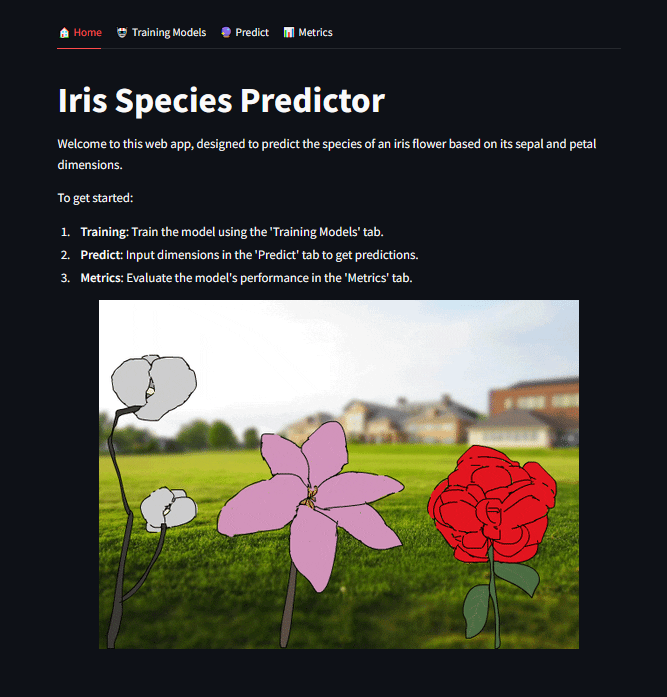
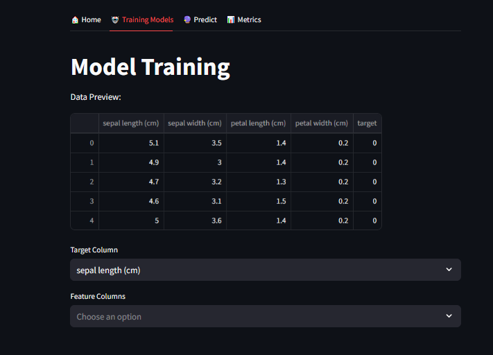
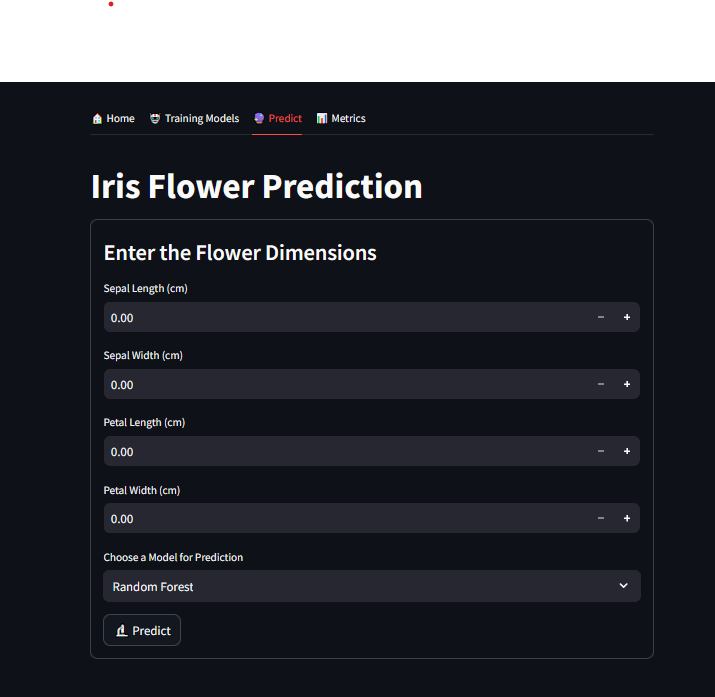
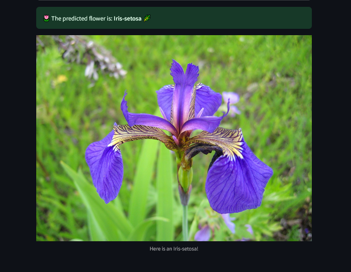
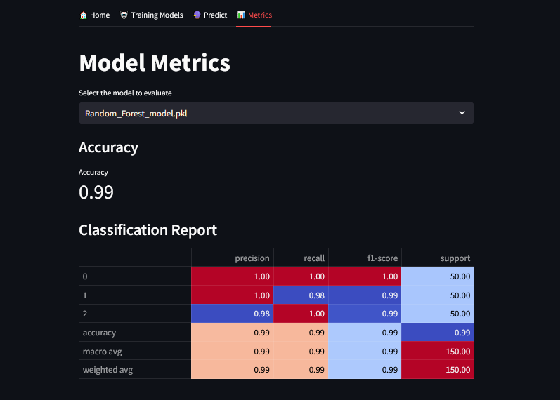

# **MLOps - Iris Flower Prediction Project** 🌸

## **Description**
This project is a Dockerized web application for predicting the class of Iris flowers (**Iris-setosa**, **Iris-versicolor**, **Iris-virginica**) using **Machine Learning** models. It integrates:
- **FastAPI**: Backend API to handle predictions.
- **MongoDB**: To store and retrieve predictions.
- **Streamlit**: For an interactive user interface.
- **Docker**: To simplify deployment and orchestration.


## **Key Features**
- 🛠 **Train Models**: Train multiple models (**Random Forest**, **SVM**, **Decision Tree**) interactively through the web interface.
- 🔮 **Predict Classes**: Input flower features and predict the flower class.
- 📊 **Analyze Metrics**: View metrics like accuracy, confusion matrices, and classification reports.
- 🗄 **Save Predictions**: All predictions are stored in **MongoDB** for easy access and analysis.


## **Technologies Used**

| Technology      | Logo                                                                                 | Description                                       |
|------------------|---------------------------------------------------------------------------------------|---------------------------------------------------|
| **FastAPI**      |                | Backend framework for building APIs.             |
| **Streamlit**    |              | Frontend library for creating web applications.  |
| **MongoDB**      |                     | Database for storing predictions.                |
| **Docker**       |            | For containerization and orchestration.          |
| **Scikit-learn** |  | Machine learning library for model training.     |


## **Project Structure**

```
iris-predictor-mlops/
├── client/             
│   ├── app.py             # Main Streamlit application
│   ├── home.py            # Home page logic
│   ├── metrics.py         # Metrics visualization page
│   ├── predict.py         # Prediction page logic
│   ├── requirements.txt   # Dependencies for Streamlit
│   └── Dockerfile         # Dockerfile for the Streamlit client
│
├── server/
│   ├── app.py             # FastAPI backend
│   ├── train.py           # Training script for ML models
│   ├── models/            # Folder for trained models
│   │   ├── Random_Forest_model.pkl
│   │   ├── SVM_model.pkl
│   │   └── Decision_Tree_model.pkl
│   ├── requirements.txt   # Dependencies for FastAPI
│   └── Dockerfile         # Dockerfile for the FastAPI server
│
├── data/                  # Data folder (e.g., Iris.csv)
│
├── assets/                # Folder to store images for the README
│   ├── home_page.png
│   ├── training_page.png
│   ├── predict_page.png
│   ├── metrics_page.png
│
├── docker-compose.yml      # Container orchestration configuration
│
└── README.md               # Documentation
```


## **Installation and Deployment**

### **1. Clone the Repository**
```bash
git clone https://github.com/lansanacisse/iris-predictor-mlops.git
cd iris-predictor-mlops
```

### **2. Build and Launch the Application**
Run the following command to start all services:
```bash
docker-compose up --build
```

### **3. Access the Application**
- **Streamlit Interface**: [http://localhost:8501](http://localhost:8501)
- **FastAPI (Swagger Docs)**: [http://localhost:8000/docs](http://localhost:8000/docs)
- **MongoDB**: Accessible via port `27017`.


## **Example Usage**

### **1. Home Page**
After launching the application, the home page provides an overview of the project. 




### **2. Train a Model**
1. Navigate to the **Training Models** tab in the Streamlit app.

   

2. Select your dataset, configure the target and feature columns, choose an algorithm (e.g., **Random Forest**, **SVM**), and set hyperparameters.
3. Click **Train** to train the model.  
4. The trained model is saved automatically in the `server/models` directory.


### **3. Make a Prediction**
1. Go to the **Predict** tab in the Streamlit app.

   

2. Enter the flower features:
   - **Sepal Length**: `5.1`
   - **Sepal Width**: `3.5`
   - **Petal Length**: `1.4`
   - **Petal Width**: `0.2`
3. Choose a model (e.g., **Random Forest**) and click **Predict**.
4. The app will display the predicted flower class and an image of the flower.
   


### **4. View Metrics**
1. Navigate to the **Metrics** tab in the Streamlit app.

   

2. Select a model from the dropdown to view:
   - **Accuracy**
   - **Confusion Matrix**
   - **Classification Report**
3. Metrics are updated dynamically based on the selected model.


## **Contact**

For questions or suggestions, feel free to contact:

- **Author**: Lansana CISSE  
- **Program**: M2 SISE  
- **GitHub**: [Lansana CISSE](https://github.com/lansanacisse)


## **Ready to Explore?**

Launch the application by running:
```bash
docker-compose up --build
```

🎉 Enjoy the **Iris Flower Prediction Project**! 🌸
